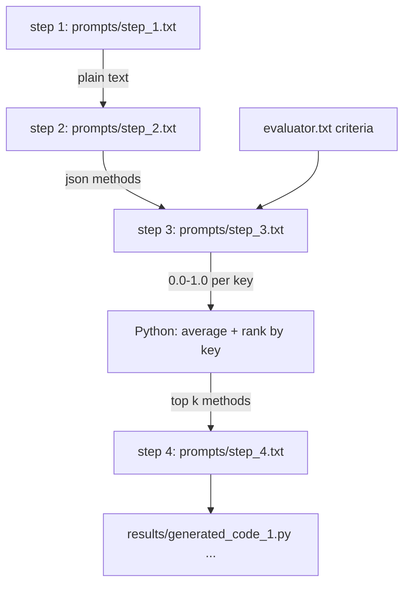

# harness-learning

Small experiments with the DeepSeek chat completion API (OpenAI-compatible).

## Files

| File | Purpose |
|------|---------|
| `deepseek_client.py` | Shared helpers: .env loading, API-key guard, client factory, message builder, stream iterator, prompt resolution |
| `deepseek_json.py` | Chat completion forced to return a **JSON object** (`response_format={"type": "json_object"}`) |
| `deepseek_text.py` | Chat completion returning **plain text**, with optional `--stream` |
| `harness.py` | Score-and-generate pipeline: step 1 text → step 2 json → step 3 per-key scores → step 4 generated code |
| `evaluator.txt` | **Edit this** — the evaluation categories (e.g. Security, Speed, OWASP) used by step 3 |
| `prompts/step_1.txt` | **Edit this** — the prompt `deepseek_text.py` sends by default (renamed from `text_prompt.txt`) |
| `prompts/step_2.txt` | Structures step 1's text into `{"methods": [...]}` json |
| `prompts/step_3.txt` | Scores each method per category from `0.0` to `1.0` |
| `prompts/step_4.txt` | Asks for Python code implementing one method |
| `prompts/json_prompt.txt` | **Edit this** — the prompt `deepseek_json.py` sends by default |
| `results/generated_code_<rank>.py` | Generated code, one file per top-`k` method, named by rank |
| `.env.example` | Template for `DEEPSEEK_API_KEY` and optional overrides |
| `requirements.txt` | Just `openai` |

## Setup

```powershell
python -m pip install -r requirements.txt
Copy-Item .env.example .env
# then edit .env and paste your key from https://platform.deepseek.com/api_keys
```

## Usage

### The simple way: edit the prompt file, run the script

```powershell
# 1) Open prompts/json_prompt.txt, type your prompt, save it, then:
python deepseek_json.py

# 2) Open prompts/step_1.txt, type your prompt, save it, then:
python deepseek_text.py
```

No arguments needed — each script reads its own prompt file by default.

### Passing a prompt instead

```powershell
# 1) JSON output (parsed, pretty-printed)
python deepseek_json.py "List 3 SDET interview questions as json"

# Any .txt/.md argument is treated as a file path, so a typo errors out safely
python deepseek_json.py my_prompt.txt

# A prompt file you keep elsewhere
python deepseek_json.py --prompt-file C:\path\to\prompt.txt

# JSON saved to a file, single-line
python deepseek_json.py --compact --out result.json

# 2) Plain text
python deepseek_text.py "Explain the Page Object Model in 3 sentences"

# 3) Plain text, streamed token by token
python deepseek_text.py --stream "Write a pytest fixture example"

# 4) Prompt from stdin ('-' means stdin)
Get-Content prompt.txt | python deepseek_text.py -
```

Prompt sources are resolved in this order:

1. `--prompt-file <path>`
2. the positional argument (inline text, a file path, or `-`)
3. `prompts/json_prompt.txt` or `prompts/step_1.txt`

## The harness pipeline

`harness.py` chains four sequential DeepSeek calls. Each one blocks until the
previous returns — no threads, no asyncio, no parallel requests.



```powershell
# Default: step 1's methods, scored by the evaluator.txt criteria, top 1 gets code
python harness.py

# Top 2 methods, with per-step logging
python harness.py --top-k 2 --verbose

# Override the criteria without editing evaluator.txt
python harness.py --criteria "Speed, Security, OWASP"

# Override the step 1 prompt
python harness.py --step1-prompt "List 3 ways to hash a password"
```

How scoring works:

1. Step 3 returns a decimal `0.0`–`1.0` score for **every key** of **every** method.
2. Python averages each method's key scores into `average_score`.
3. Methods are ranked by that average, highest first. Ties keep step 2's order.
4. Each of the top `k` methods gets its own `results/generated_code_<rank>.py`.

Prompts are never hardcoded in Python. Each step reads its own editable `.txt`
template, and the previous step's output is injected into the `{{PAYLOAD}}`
placeholder (`{{CRITERIA}}` for the evaluator text in step 3).

## As a module

```python
from deepseek_json import chat_json
data = chat_json("Return the resume skills as json")

from deepseek_text import chat_text, chat_text_stream
print(chat_text("Draft a cold outreach email"))

from harness import run_harness
scored, top, files = run_harness("prompt text", "Speed, Security, OWASP", top_k=2)
```

Both scripts import their shared plumbing from `deepseek_client.py`, so keep the
three files in the same directory (or install them as a package).

## Gotchas

- DeepSeek rejects `response_format={"type": "json_object"}` unless the word `json` appears in the messages. `deepseek_json.py` auto-appends "Respond in json." when it's missing.
- Models: `deepseek-chat` (V3, fast, default) and `deepseek-reasoner` (R1, emits `reasoning_content`; no JSON mode). **`deepseek-reasoner` does not support JSON mode**, so the harness's step 2 and step 3 need `deepseek-chat`.
- Both scripts fail fast with a clear message when `DEEPSEEK_API_KEY` is unset.
- Generated code is written but **not executed**. Review it before running.
